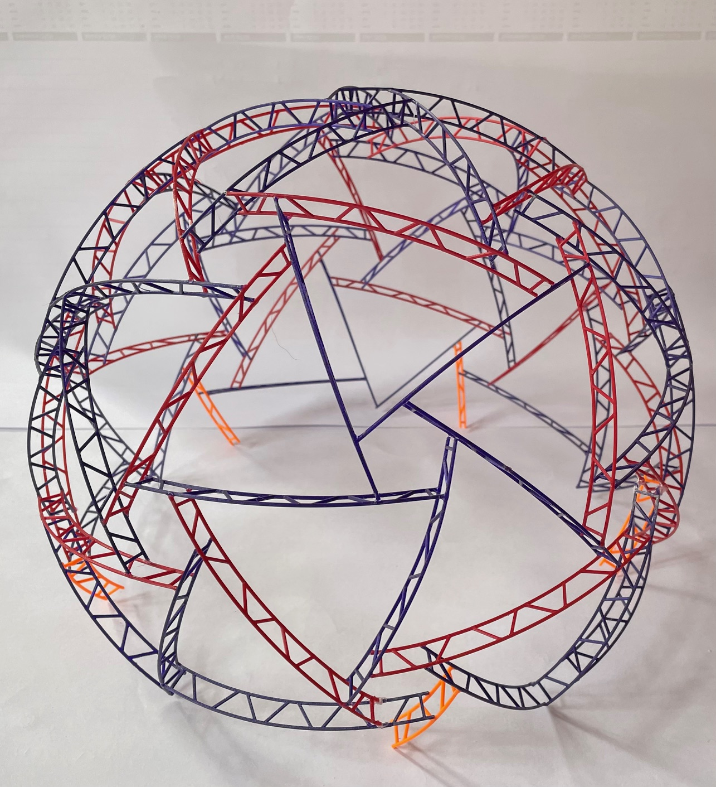

# Neodome
Neodome is a neopixel covered geodesic dome. Its first installation was in August 16th to 18th 2024 at [Fri3d Camp](https://fri3d.be/), a hacker camp in Belgium.

<picture>
    
</picture>

## Folders
This project is divided in these folders:
- [dome_hardware](./dome_hardware/): The geodesic dome hardware (constructed with PVC electrical conduits).
- [led_hardware](./led_hardware/): The LED hardware (power supplies, addressable LED strips, power distribution and IRA nodes).
- [.led_software](./led_software/): firmware running on the IRA nodes (WLED, WLED with NATS) and possibly other external software controlling the lighting.