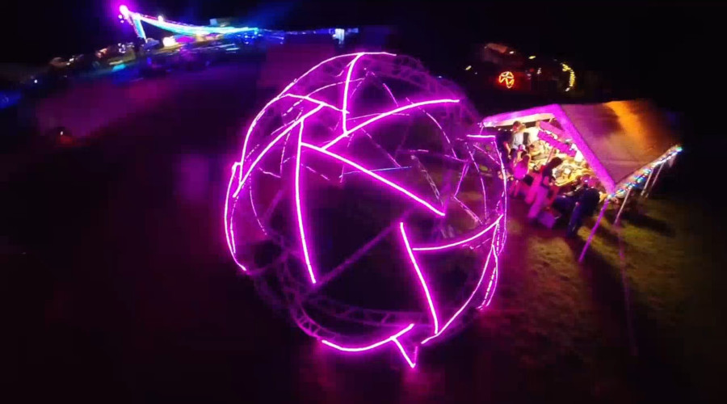

# Neodome
Neodome is geodesic dome made from PVC tube trusses lined with neopixel LED strips. Its first installation was in August 16th to 18th 2024 at [Fri3d Camp](https://fri3d.be/), a hacker camp in Belgium.

## Neo Dome? Neodome!
[Koen](https://github.com/kavers1) explains that the project is called "Neodome" for these reasons:
1. It features a *dome* with *neo*pixels.
2. It represents a *new* design of a geodesic dome, specifically for Koen.
3. The design, as far as he has been able to find, appears to be *unique*. The shape incorporates pentagons and hexagons, with triangles in between, a configuration that Koen has not yet come across on any other websites or in his searches. While he hasn't conducted an exhaustive search, he has already explored numerous resources. Hence, he chose the name **Neodome**.

## Folders
This project is divided in these folders:
- [dome_hardware](./dome_hardware/): The geodesic dome hardware (constructed with PVC electrical conduits).
- [led_hardware](./led_hardware/): The LED hardware (power supplies, addressable LED strips, power distribution and IRA nodes).
- [led_software](./led_software/): firmware running on the IRA nodes (WLED, WLED with NATS) and possibly other external software controlling the lighting.