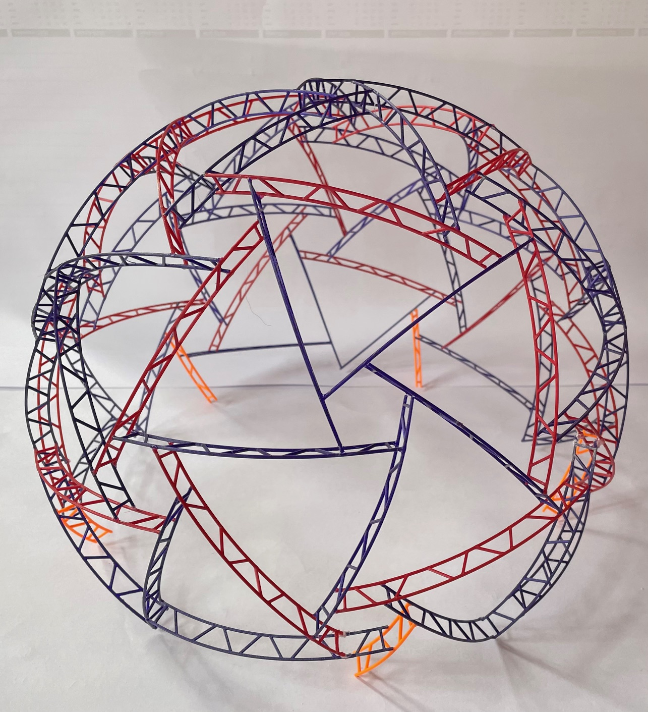
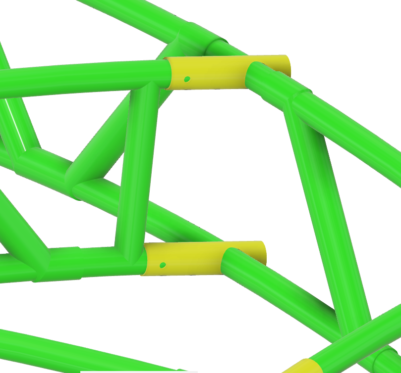

# Neodome
Neodome is a neopixel lined geodesic dome. This README covers the build of the geodesic dome.

## Bill Of Materials
- PVC electrical conduit tubes
  - 20x big: diameter? length?
  - 100x? small: diameter? length?
- PVC glue
- 260 to 280 [Locking Pin](https://www.techniekwebshop.nl/gopart-borgpen-8-x-45mm-lp845gp-45-mm-7-mm.html)

## Tools
<!-- TO DO: add the needed tools for component build and assembly -->
- 8.5mm drill for Locking Pin holes

## Component build
Build the appropriate amount of every component.

| Component             | Amount needed | STL file for 3D printing a model      |
|-----------------------|--------------:|---------------------------------------|
| Penta truss           |            40 | [model/penta_truss3_3D.stl]           |
| Hexa truss            |            20 | [model/hexa_truss3_3D.stl]            |
| Penta ground truss    |             5 | [model/penta_ground_truss3_3D.stl]    |
| Hexa ground truss     |             5 | [model/hexa_ground_truss3_3D.stl]     |
| Ground truss          |             5 | [model/hexa_ground_truss3_3D.stl]     |

### Printing a 3D model
The [model](model/) folder contains STL files you can print with a 3D printer. If you first build the dome with the 3D printed pieces, you have a model as reference. If you use a scaling factor of 0.1, 1 m becomes 10 cm.

If you also print the *ground trusses*, your model will stand more stable:

### Tube lengths

- 500x Diagonals of ? length and ? diameter
- **To be further determined**

### Tube hole drilling

You can use a jig for drilling the holes at the correct spacing:

### Truss construction

You will need different diameters and lengths of PVC electrical conduit to build every component. Every truss component is a 2D construction consisting of 2 long tubes connected by short diagonals and 2 shorter connecting tubes at each end that accept another truss:

| Component | Outer Diameter    | Length    | Amount    |
|-----------|-------------------|-----------|-----------|

## Component Assembly
Assemble the components is the correct steps. First building the top part.